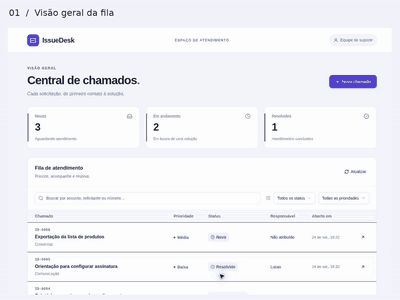
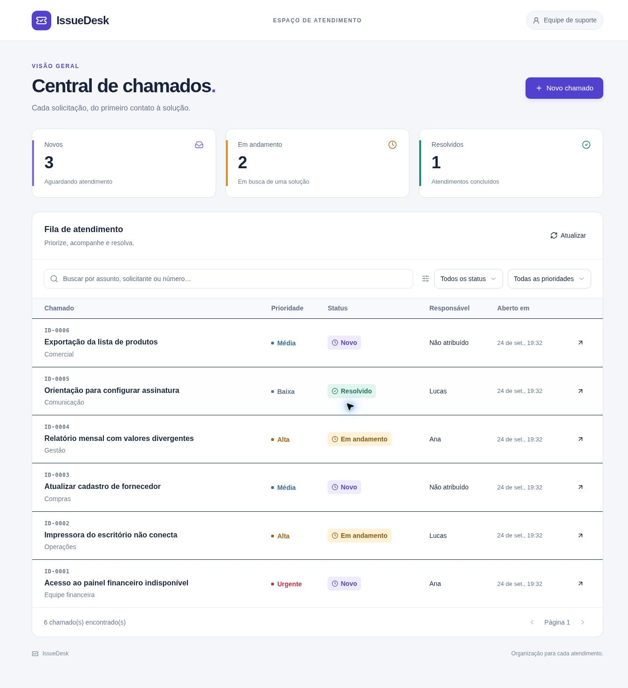
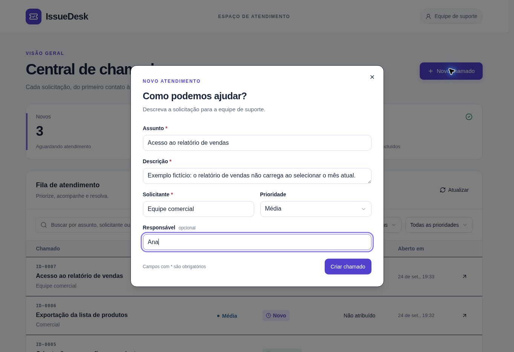
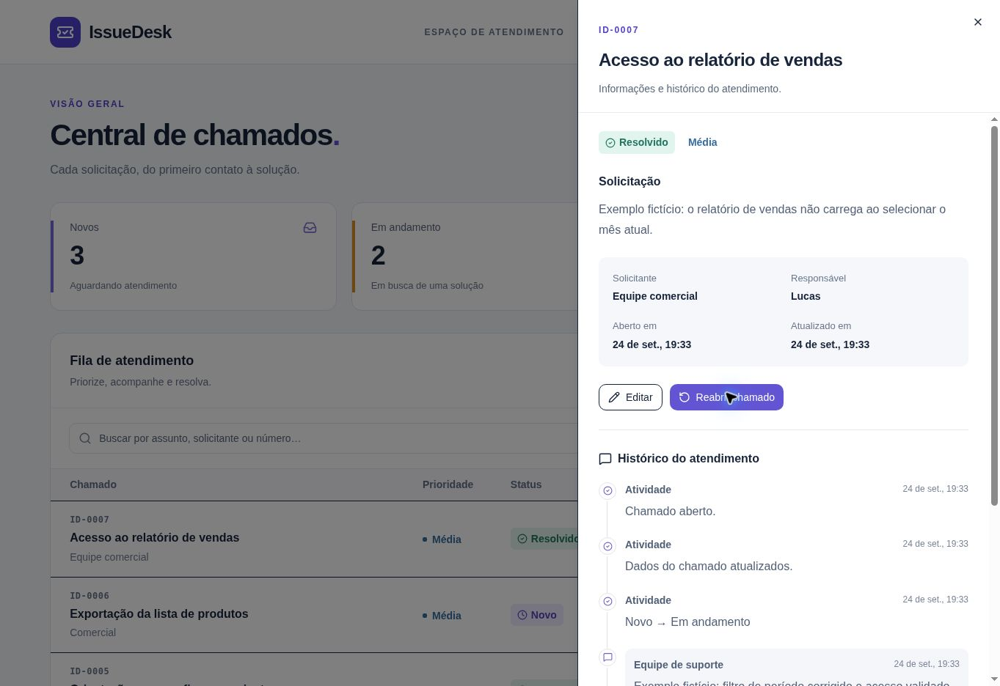
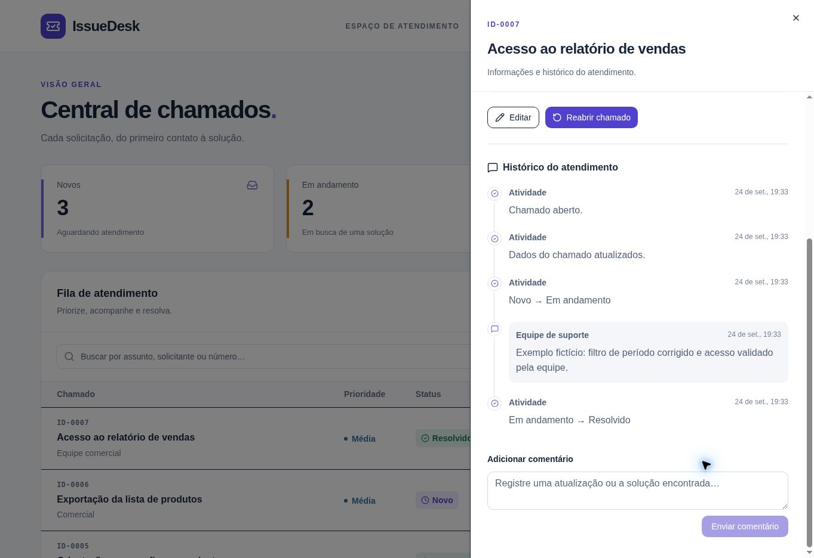

# IssueDesk

**A focused help desk for turning requests into resolved tickets.**

IssueDesk brings ticket creation, priority, assignment, comments and status tracking into one responsive workspace. It demonstrates a complete user-facing workflow with shared validation, persistent storage and tests.

**React · TypeScript · Zod · SQLite / Cloudflare D1 · Drizzle · GitHub Actions**

[Project case study](docs/CASE-STUDY.md) · [Architecture](docs/ARCHITECTURE.md) · [HTTP API](docs/API.md) · [Validation](docs/VALIDATION.md)

## See the workflow

Review the app without signing in: these screenshots and the **35-second visual walkthrough** show a local instance using fictional data. The video is an annotated sequence of real interface captures, not a continuous screen recording.

[Watch / download the walkthrough (MP4)](docs/media/issuedesk-walkthrough.mp4) · [Capture notes and reproduction steps](docs/DEMO.md)



### Workspace overview



<details>
<summary>View ticket creation and resolution screenshots</summary>

**Create a ticket with a requester and an assignee**



**Resolve the ticket**



**Review the history**



</details>

## Features

- Create and edit tickets with validated fields.
- Search by subject, requester or ticket number.
- Filter by status and priority, with server-side pagination.
- Assign a responsible person and record comments.
- Start, resolve and reopen a ticket with explicit workflow rules.
- Reject stale edits instead of silently overwriting another tab.
- Keep changes and history together in a database transaction.
- Use responsive ticket cards on mobile and a table on larger screens.
- Load fictional examples into an empty workspace to explore the flow.

## Run locally

Requires Node.js 24.15 or newer in the 24.x series. No Cloudflare account is required for the local database.

```sh
git clone https://github.com/juliancrv777/issuedesk.git
cd issuedesk
npm ci
npm run build
node --import ./scripts/sites-env.mjs ./node_modules/wrangler/bin/wrangler.js d1 execute DB --local --config dist/server/wrangler.json --persist-to .wrangler/state --file drizzle/0000_schema.sql
npm run dev
```

Open the address printed by the development server. Apply the initial migration only once to a fresh local database. It is checked into the repository; `npm run db:generate` is needed only after changing the schema. Local records live in ignored `.wrangler/state` files. To preview the production build instead, run `npm start` and use its printed address.

On Windows PowerShell, use `npm.cmd` if the script execution policy blocks `npm`.

## Check the project

```sh
npm run typecheck
npm test
npm run build
npm run test:integration
```

The thirteen tests cover JSON transport, API error handling, cancellation, validation, creation retries, filters, pagination, comments, stale edits, workflow transitions, rollback and missing records. Three additional HTTP integration tests exercise the compiled Worker and local D1: the ticket lifecycle, search/filter/pagination, and request validation. The integration suite starts its own local server, applies the checked-in migrations to a temporary database, and removes that database afterward. Run the build first; no deployment credentials or external base URL are required. Both suites run in GitHub Actions. See [the validation record](docs/VALIDATION.md) for coverage and limitations.

## Implementation

The UI calls a small REST API. Zod schemas are shared with the server, and SQL queries use bound parameters. Ticket mutations include a version number; a mismatch returns 409 while preserving the submitted form. D1 batches commit the ticket update and its history together.

The runtime uses Vinext/Vite with a Cloudflare Worker adapter. The repository includes its build integration and logical D1 binding. This is a single application with a small domain, rather than a collection of microservices.

## Access and deployment

This version has one shared workspace and one permission level. Requester and assignee names are labels, not user accounts. Everyone admitted by the hosting gateway can read and modify every ticket. The app does not implement authentication or role-based authorization.

The hosted demonstration is private. A separate hosting access policy controls who can open it; a public GitHub repository does not grant access to the running application. Before exposing an independent deployment, add an access gateway or app-level authentication and authorization. Do not treat the local development server as a secured production service.

Generated schema migrations are included in the build for the Sites deployment integration. Hosting identifiers are configuration, and no source-access credentials are stored in this repository.

## Scope

This release focuses on a complete ticket workflow. It does not include attachments, email notifications, SLA calculations, individual activity attribution or production operations such as backups and monitoring.

Possible next increments: authenticated team membership, role permissions, automated browser tests and an outbox for notifications. These are planned improvements, not implemented features.
